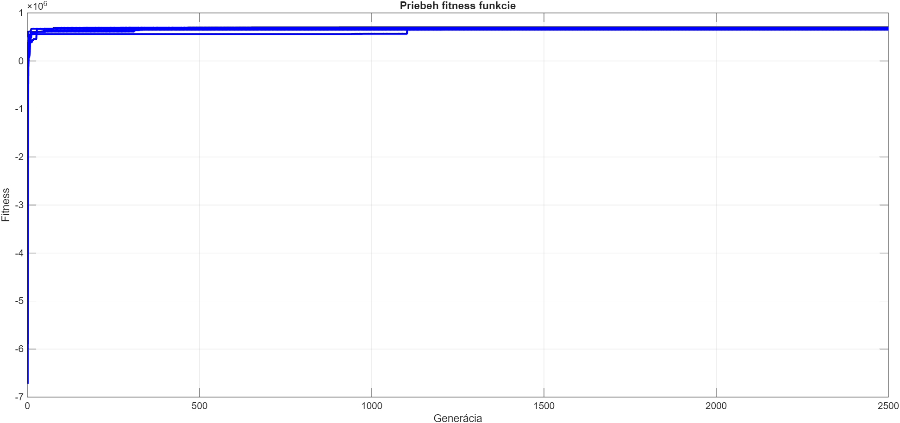

# Optimalizácia investičného portfólia pomocou genetického algoritmu

## Parametre genetického algoritmu

| Parameter | Hodnota |
|---|---|
| Veľkosť populácie | 100 |
| Počet generácií | 2500 |
| Počet behov | 5 |
| amp | 1 - 20 |
| mutRate | 0.1 |
| selbest | 3 2 1 |
| selbest | 3 2 1 |
| selsus  | 88 |
| Rozsah premenných | 0 – 10 000 000 |
| mrtva pokuta | 1e+20 |
| stupnovita | 1e+5 |
| umerna | --- | 
---
## Bez pokuty

### Graf konvergencie

### Výsledky jednotlivých behov

| Run | Finálna fitness |
|---|---|---|
| 1 | 3300000 | 
| 2 | 3300000 | 
| 3 | 3300000 | 
| 4 | 3300000 | 
| 5 | 3300000 |

### Najlepší jedinec

| Premenná | Hodnota |
|---|---|
| x1 | 10000000 |
| x2 | 10000000 |
| x3 | 10000000 |
| x4 | 10000000 |
| x5 | 10000000 |

---
## Metóda 1 – Mŕtva pokuta

Pri mŕtvej pokute dostane riešenie veľkú fixnú penalizáciu, ak poruší niektoré obmedzenie. Neprípustné riešenia sú preto rýchlo vyradené z evolúcie.

### Graf konvergencie

### Výsledky jednotlivých behov

| Run | Finálna fitness |
|---|---|---|
| 1 | 6.010151e+05 | 
| 2 | 6.355475e+05 | 
| 3 | 6.452212e+05 | 
| 4 | 5.683649e+05 | 
| 5 | 6.559407e+05 | 

### Najlepší jedinec

| Premenná | Hodnota |
|---|---|
| x1 | 0.5618e+06 |
| x2 | 1.8427e+06 |
| x3 | 1.5157e+06 |
| x4 | 3.3762e+06 |
| x5 | 2.7036e+06 |

---

## Metóda 2 – Stupňovitá pokuta

Pri stupňovitej pokute závisí penalizácia od počtu porušených obmedzení. Čím viac obmedzení riešenie poruší, tým väčšiu pokutu dostane.

### Graf konvergencie

### Výsledky jednotlivých behov

| Run | Finálna fitness | 
|---|---|---|
| 1 |  6.788614e+05 | 
| 2 | 6.732438e+05 | 
| 3 | 6.884136e+05 | 
| 4 | 6.785248e+05 | 
| 5 | 6.842070e+05 | 

### Najlepší jedinec

| Premenná | Hodnota |
|---|---|
| x1 | 0.0769e+06 |
| x2 | 2.3005e+06 |
| x3 | 1.9048e+06 |
| x4 | 2.8886e+06|
| x5 | 2.8292e+06 |

---

## Metóda 3 – Úmerná pokuta

Pri úmernej pokute je penalizácia priamo úmerná miere porušenia obmedzenia. Riešenia, ktoré sú bližšie k prípustnej oblasti, dostávajú menšiu pokutu.

### Graf konvergencie

### Výsledky jednotlivých behov

| Run | Finálna fitness |
|---|---|---|
| 1 | 6.994843e+05 | 
| 2 |  6.747035e+05 | 
| 3 | 6.831093e+05 | 
| 4 | 6.847989e+05 | 
| 5 | 6.516826e+05 | 

### Najlepší jedinec

| Premenná | Hodnota |
|---|---|
| x1 | 0.7986 |
| x2 | 1.7014 |
| x3 | 2.5000 |
| x4 | 2.4858 |
| x5 |  2.4858 |
