# MLP - classification of medical data

## Parameters

| Type | Structure | Epoch
|---|---|---|
| M1 | 50 | 100
| M2 | 50 50 | 100
| M3 | 70 70 70 | 100

---
## Accuracy over each run
### neuron_struct1
| Run | Accuracy on testing data |  Accuracy on training data |
|---|---| ---|
| 1 | 92.4 | 96.8 |
| 2 | 91.4 | 96.9 |
| 3 | 91.5 | 97.3 |
| 4 | 92 | 97.2 |
| 5 | 94.2 |96.9 |  

---
### neuron_struct2
| Run | Accuracy on testing data |  Accuracy on training data |
|---|---| ---|
| 1 | 92.2 | 95.9 |
| 2 | 91.3 | 95.6 |
| 3 | 91.6 | 97.6 |
| 4 | 91.6 | 97.4|
| 5 | 92.7 |97.7 |

---
### neuron_struct3
| Run | Accuracy on testing data |  Accuracy on training data |
|---|---| ---|
| 1 | 91.1 | 98.4 |
| 2 | 91.6 | 97.2 |
| 3 | 92.6 | 98.0|
| 4 | 93.1 | 97.7|
| 5 | 90.7 |96.5 |

---
## summary of structures
| Type | Min test| Max test|  Mean test| Min train| Max train|  Mean train|
|---|---| ---|---|---| ---|---|
| M1 | 91.4 | 94.2 | 92.3 | 96.8 | 97.3 | 97.02 |
| M2  |  91.3 | 92.7 | 91.88 | 95.6 | 97.7 | 96.84 |
| M3  | 90.7 | 93.1 |91.82 | 96.5 | 98.4 | 97.56 |

---
## confusion matrices with best test score and overall score

### Specifity
| Type | Class 1 | Class 2| Class 3|
|---|---| 
| Train | 94.7% | 98.4% | 99.5% | 
| Test |  90.2% | 97.1% | 98.7% | 
| All | 92.9% |97.9% | 99.2% | 

---
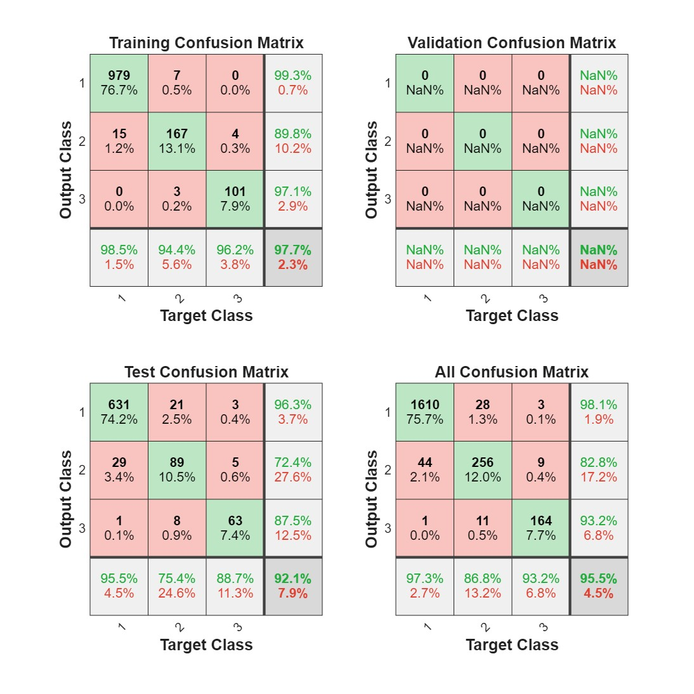

### Specifity
| Type | Class 1 | Class 2| Class 3|
|---|---| 
| Train | 94.8% | 99.1% | 99.7% | 
| Test |  84.6% | 96.0% | 98.9% | 
| All | 90.7% | 97.9% | 99.4% | 

---
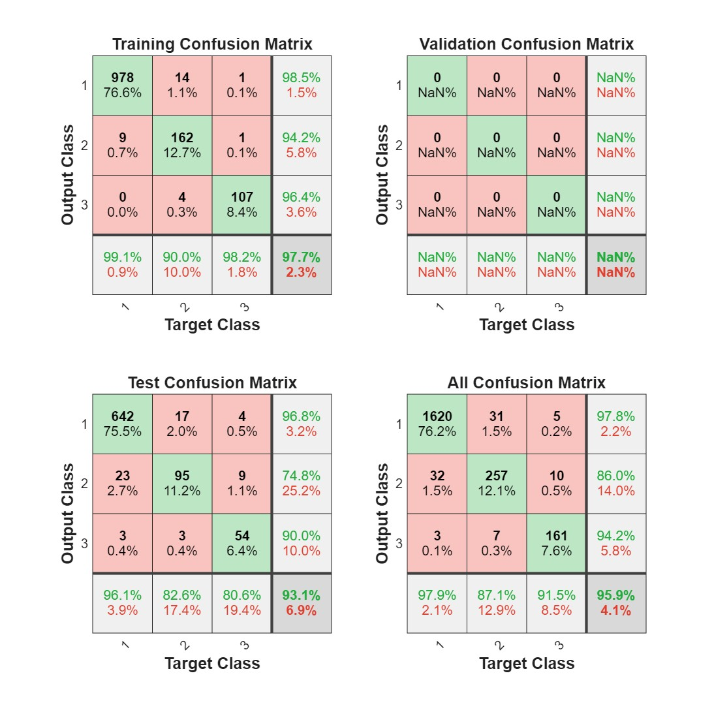

### Specifity
| Type | Class 1 | Class 2| Class 3|
|---|---| 
| Train | 96.8% | 98.4% | 99.8% | 
| Test |  86.1% | 97.2% | 98.4% | 
| All | 92.6% | 97.9% | 99.2% | 

---
## confusion matrices with best train score
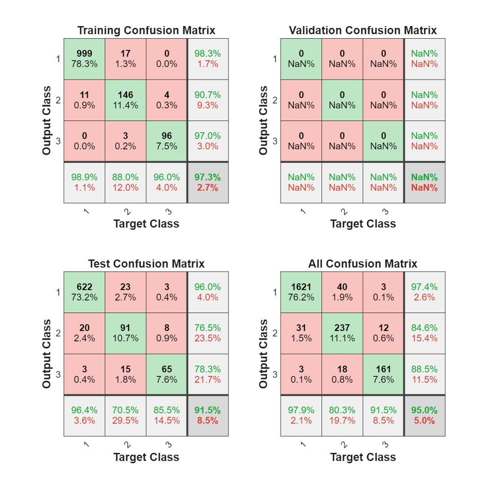
### Specifity
| Type | Class 1 | Class 2| Class 3|
|---|---| 
| Train | 95.8% | 98.2% | 99.7% | 
| Test |  88.6% | 94.8% | 98.6% | 
| All | 92.6% | 96.9%| 99.2% | 

---
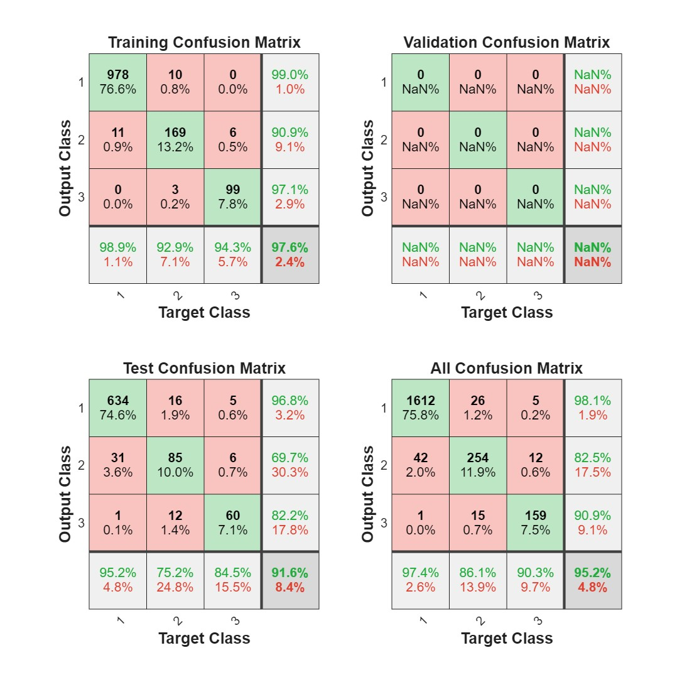
### Specifity
| Type | Class 1 | Class 2| Class 3|
|---|---| 
| Train | 96.2% | 98.8% | 99.5% | 
| Test |  83.6% | 96.2% | 98.6% | 
| All | 91.1% | 97.7% | 99.1% | 

---
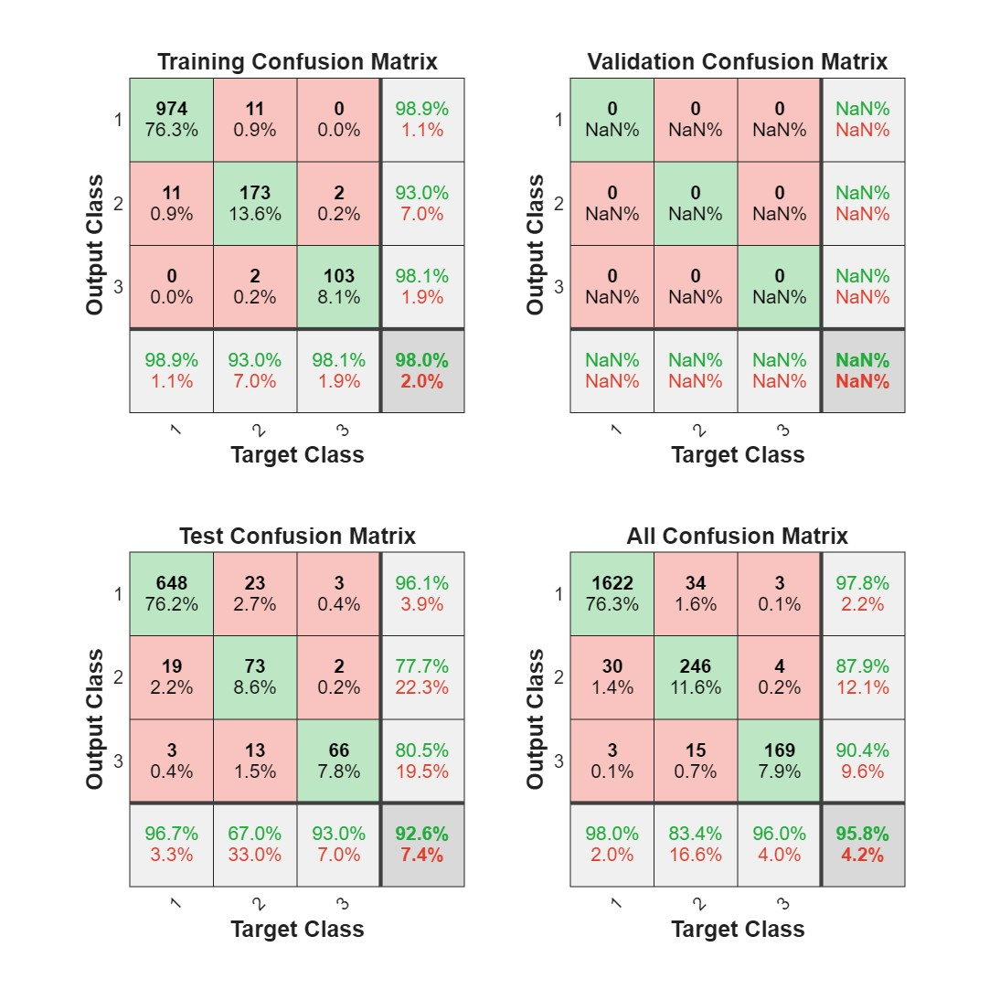
### Specifity
| Type | Class 1 | Class 2| Class 3|
|---|---| 
| Train | 96.2% | 98.8% | 99.8% | 
| Test |  87.5% | 95.2% | 99.3% | 
| All | 92.9% | 97.3% | 99.6% | 

---

## loss-epoch graphs for best test scores
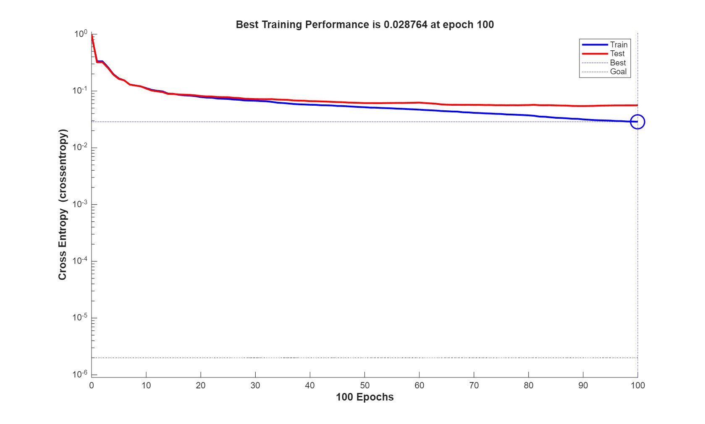
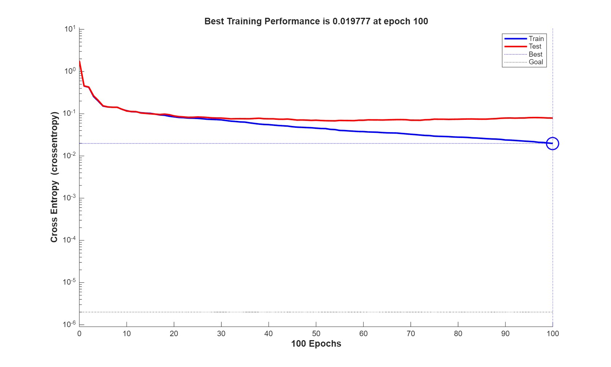
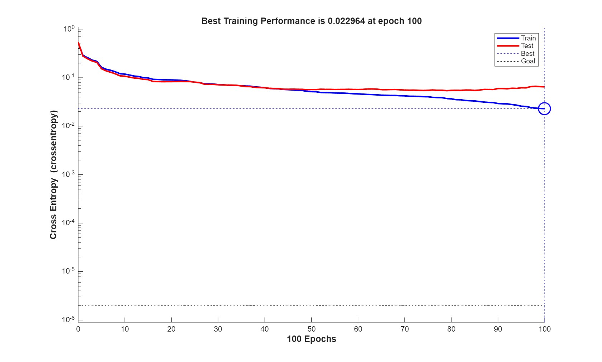

## loss-epoch graphs for best train scores
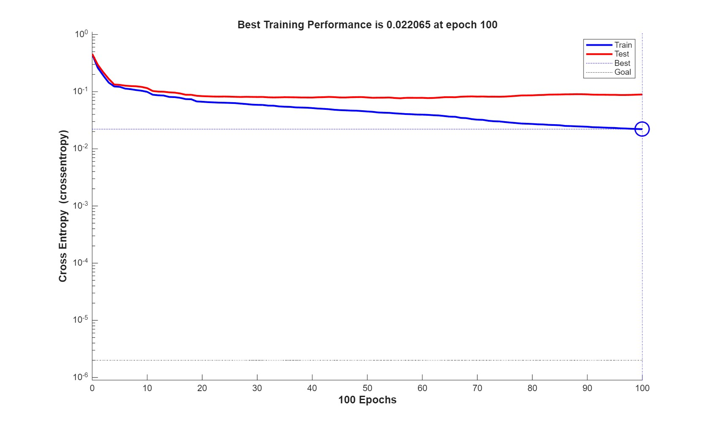
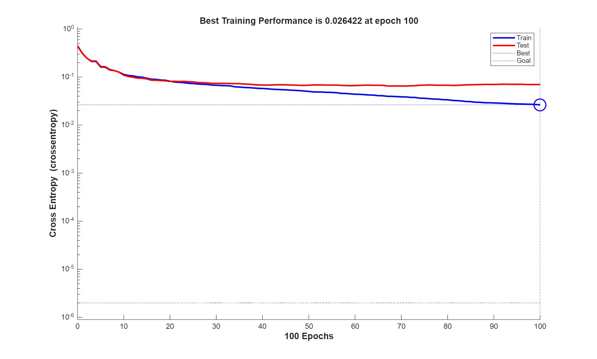
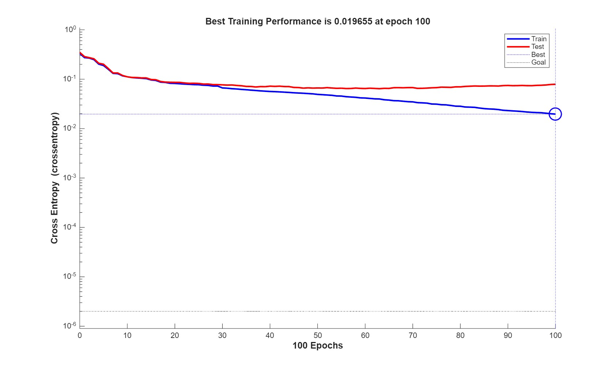
### Test M1
| -- | 1 |  2 | 3|
|---|---| ---| ---|
| 1 | 1.0 | 0.0 | 0.0 |
| 2 | 0.0 | 0.98 | 0.02 |
| 3 | 0.0 | 0.02| 0.98 |

### Test M2
| -- | 1 |  2 | 3|
|---|---| ---| ---|
| 1 | 1.0 | 0.0 | 0.0 |
| 2 | 0.0 | 0.82 | 0.0 |
| 3 | 0.0 | 0.18| 1.0 |

### Test M3
| -- | 1 |  2 | 3|
|---|---| ---| ---|
| 1 | 1.0 | 0.0 | 0.0 |
| 2 | 0.0 | 0.09 | 0.0 |
| 3 | 0.0 | 0.91| 1.0 |
