# MLP - MNIST dataset

## Parametre

| Model | Skryté vrstvy | Neurony |LR | Epochy | podiel T:V | Skoré ukončenie | 
|---|---|---|---|---|---|---|
| MLP1 | 1 | 256 | 0.01 | 300 | 80:20 | 20
| MLP2 |  2 | 256 128| 0.01 | 300 | 80:20 | 20
---

## Behy
### MLP1
| Beh | Trénovacia presnosť | Testovacia presnosť | train loss| test loss |
|---|---| ---|---|---|
| 1 | 99.8 | 97.5 | 0.0015|  0.009|
| 2 | 99.7 | 97.4 | 0.0016| 0.0095|
| 3 | 99.6 | 97.2 | 0.0030 | 0.010|
| 4 | 99.8 | 97.5|  0.0012|  0.0088|
| 5 | 99.5 |97.3 |  0.0020 |0.0097 |

---
### MLP2
| Run | Trénovacia presnosť |  Testovacia presnosť |  train loss| test loss |
|---|---| ---| ---| ---|
| 1 | 99.5 | 97.2 |0.0019 | 0.0096 |
| 2 | 99.8 | 97.5 |0.0012 | 0.0091 |
| 3 | 99.4 | 97.3 |0.0023 | 0.010 |
| 4 | 99.6 | 97.1|0.0016 | 0.0103 |
| 5 | 98.9 |97.2 |0.0036 | 0.0096 |

---

---
## Zhodnotenie
| Model | Min test| Max test|  Priemer test| Priemer test loss |
|---|---| ---|---|---|
| M1 | 97.2 | 97.5 | 97.38 | 0.0094 |
| M2  |  97.1 | 97.5 | 97.26 | 0.00972 |

---
## Matice zámien pre MLP

### MLP1
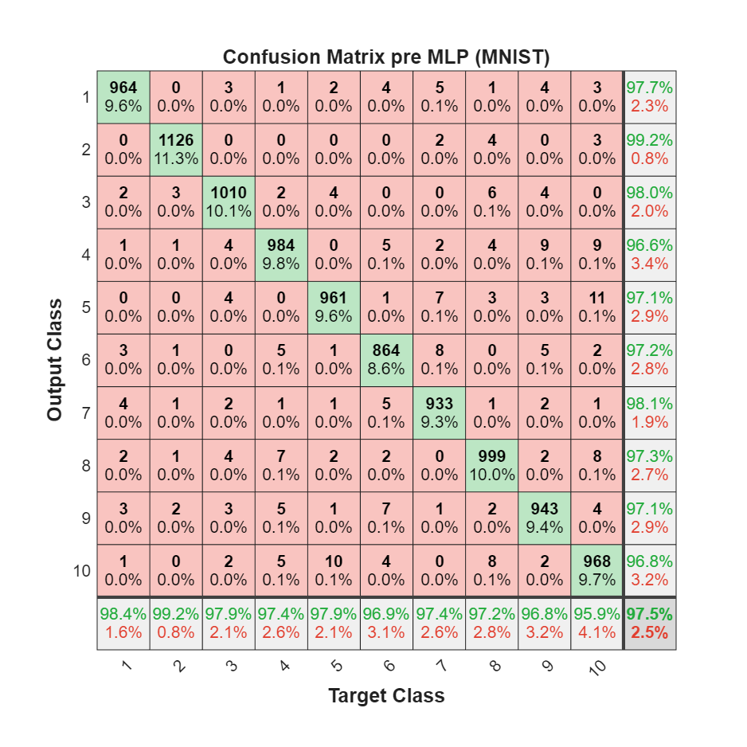

---
### MLP2

---

## Grafy loss-epoch priebehu

### MLP1
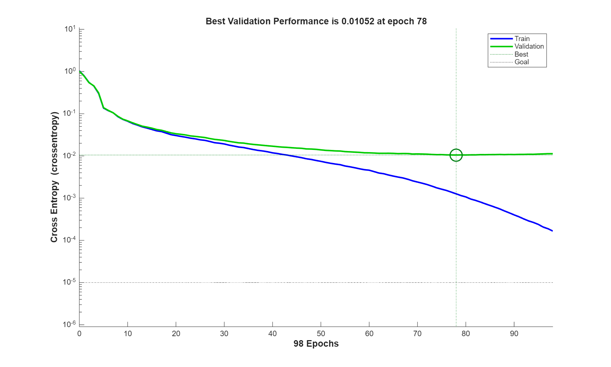

### MLP2
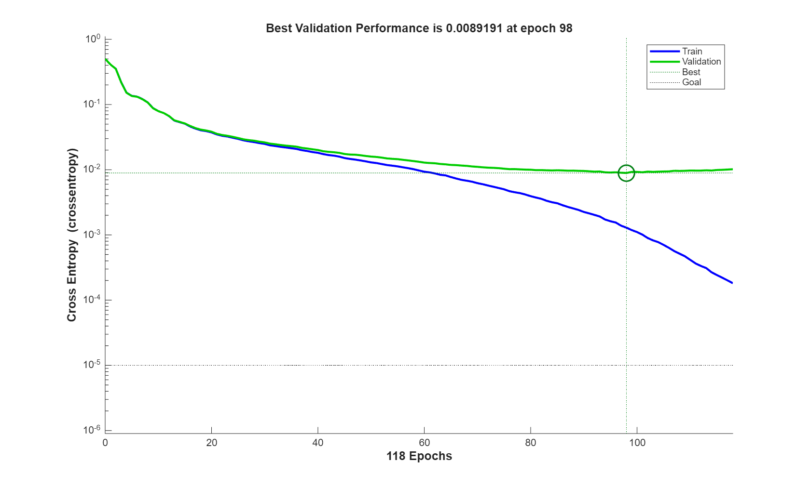

## Vykreslenie vybraných vzoriek
### MLP1

### MLP2
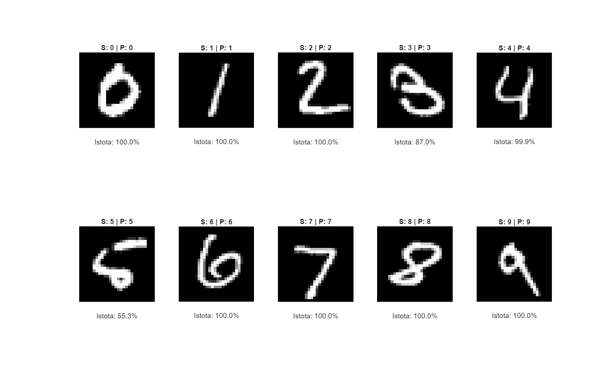

# CNN - MNIST dataset

## Parametre

| Model | Konvolucne vrstvy | Filtre | Velkost filtra|  FC vrstvy  | Dropout |Epochy | podiel T:V | Skore ukoncenie | frekvencia validacii | batch size|
|---|---|---|---|---|---|---|---|---|---|---|
| CNN1 | 2 | 16, 32 | 5x5, 3x3 | 128 | 0.3 |40 | 80:20 | 65 | 30 | 128
| CNN2 |  3 | 8, 16, 32 | 5x5, 3x3, 3x3 | 128 |0.3| 40 | 80:20 | 65 | 30 | 128
| CNN3 | 3 | 16, 32, 64 | 5x5, 3x3, 3x3 | 128 |0.3| 40 | 80:20 | 65 | 30 | 128
---

## Behy
### CNN1
| Beh | Trenovacia presnost | Testovacia presnost | train loss| test loss |
|---|---| ---|---|---|
| 1 | 99.8 | 99.1 | 0.0207 |  0.0322 |
| 2 |  99.8 | 99.1 | 0.0277 | 0.0940|
| 3 |  99.6 | 99.0 | 0.0051 |  0.0375|
| 4 |  99.8 | 99.2 | 0.0027 |  0.0288|
| 5 |  99.9 | 99.1 | 0.0068 |  0.0286|

---
### CNN2
| Run | Trenovacia presnost |  Testovacia presnost |  train loss| test loss |
|---|---| ---|---|---|
| 1 | 99.8 | 99.1 | 0.0197|  0.0299|
| 2 |  99.5 | 99.0 | 0.0397|  0.0304|
| 3 |  99.8 | 99.2 | 0.0254 |  0.0295|
| 4 |  99.8 | 99.1 | 0.0105 |  0.0323|
| 5 |  99.9 | 99.2 | 0.0338|  0.0274|

---
### CNN3
| Run | Trenovacia presnost |  Testovacia presnost |  train loss| test loss |
|---|---| ---|---|---|
| 1 | 99.8 | 99.4 | 0.0017|  0.0218|
| 2 |  99.9 | 99.3 | 0.0046|  0.0244|
| 3 |  99.8 | 99.1 | 0.0290|  0.0309|
| 4 |  99.8| 99.4 | 0.0004|  0.0208|
| 5 |  99.8 | 99.3 | 0.0692|  0.0244|
---

## Zhodnotenie štruktúr CNN
| Model | Min test| Max test|  Priemer test| Priemer test loss |
|---|---| ---|---|---|
| CNN1 | 99.0 | 99.2 | 99.1 | 0.0442 |
| CNN2  |  99.0 | 99.2 | 99.12 | 0.0299 |
| CNN3  |  99.1 | 99.4 | 99.36 | 0.0244 |
---
## Matice zámien pre CNN
### CNN1
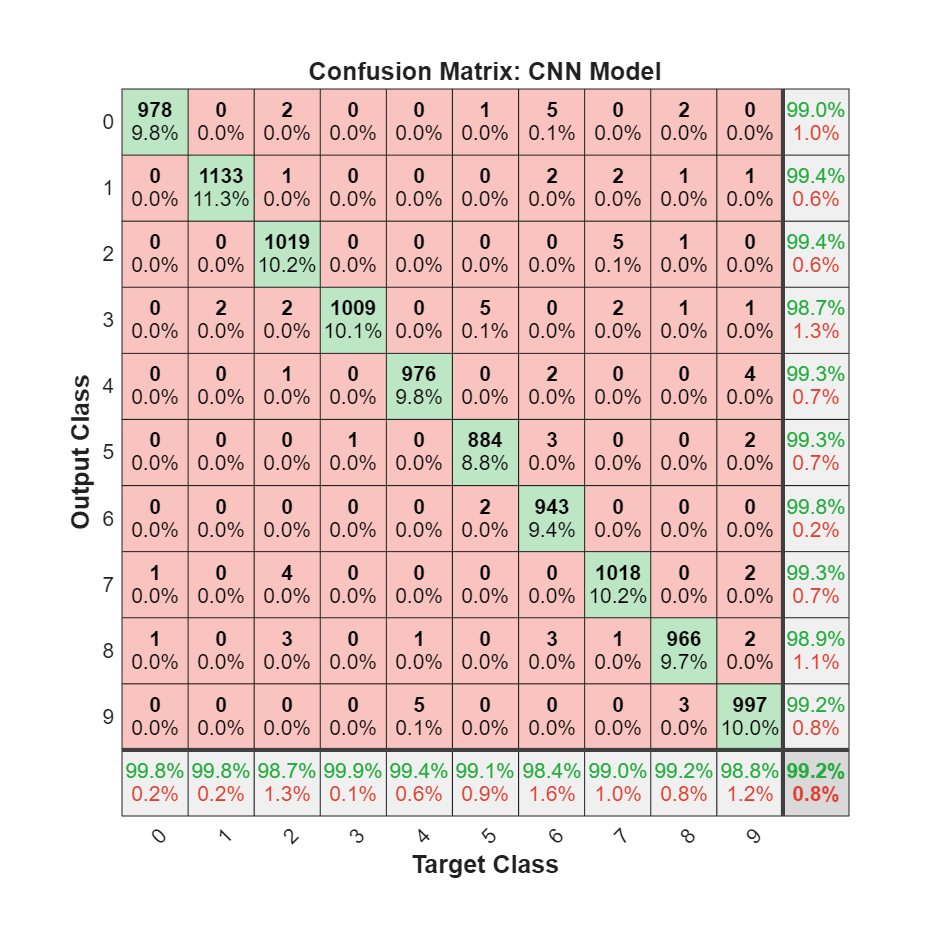

---
### CNN2

---
### CNN3
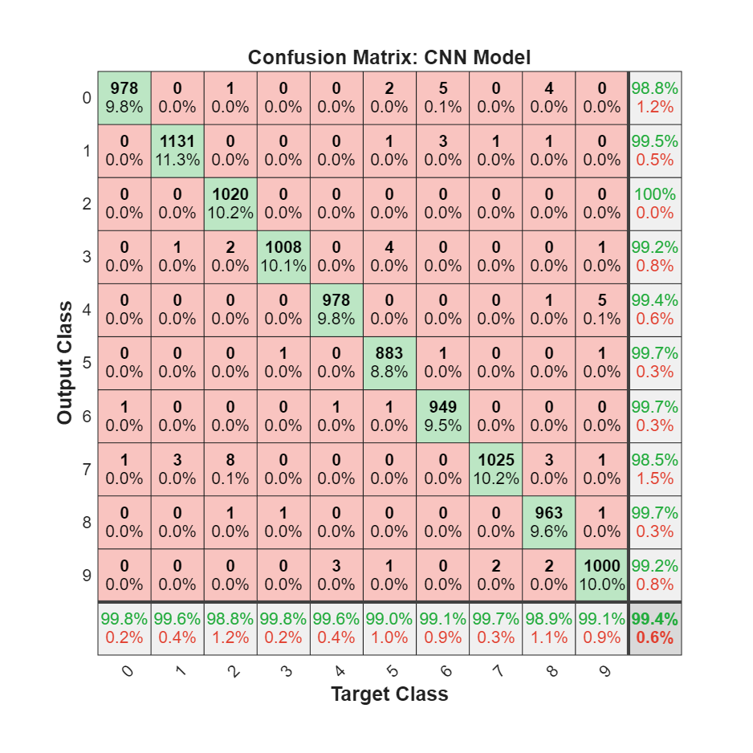

---
## Grafy loss-epoch priebehu
### CNN1
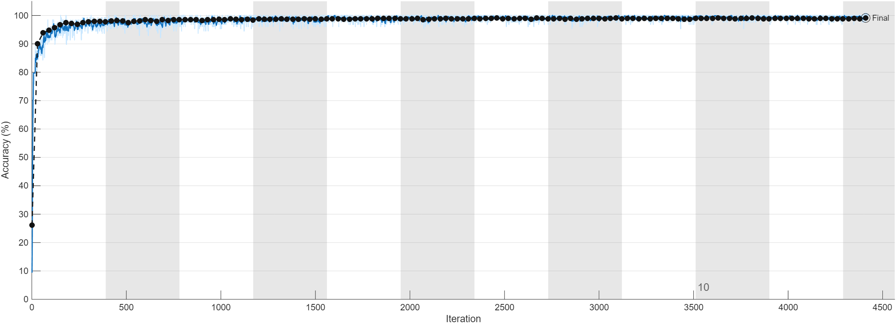
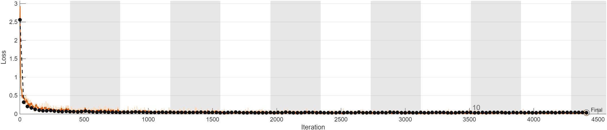

### CNN2
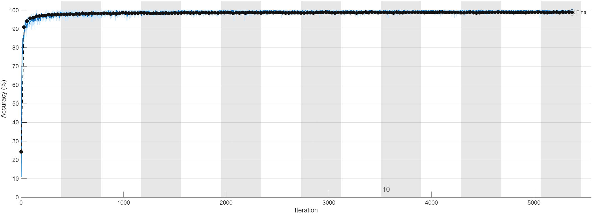
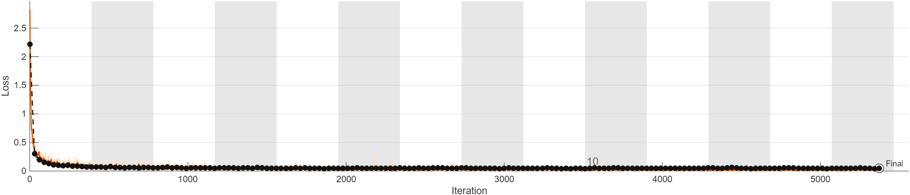
### CNN3
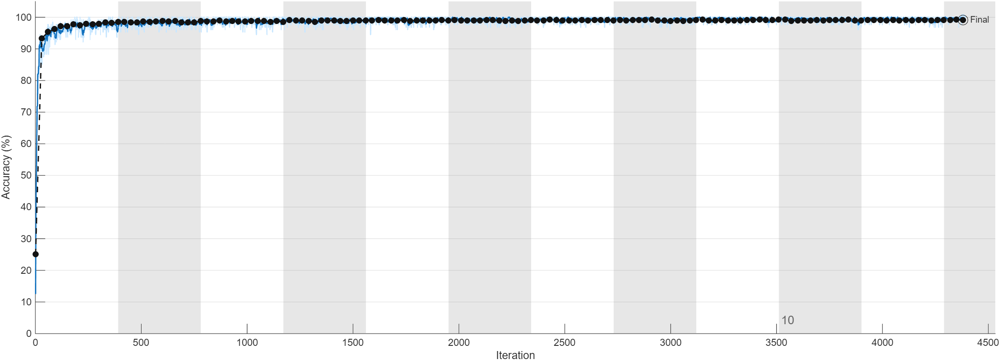
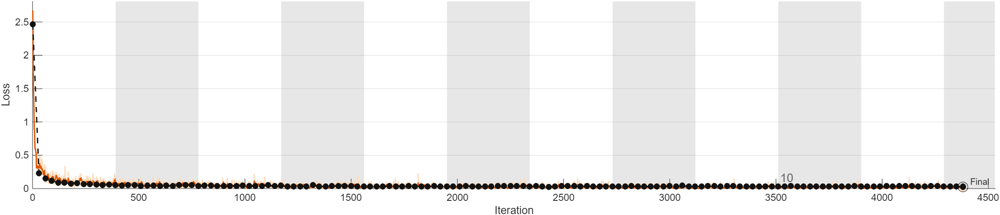

## Vykreslenie vybraných vzoriek
### CNN1

### CNN2

### CNN3
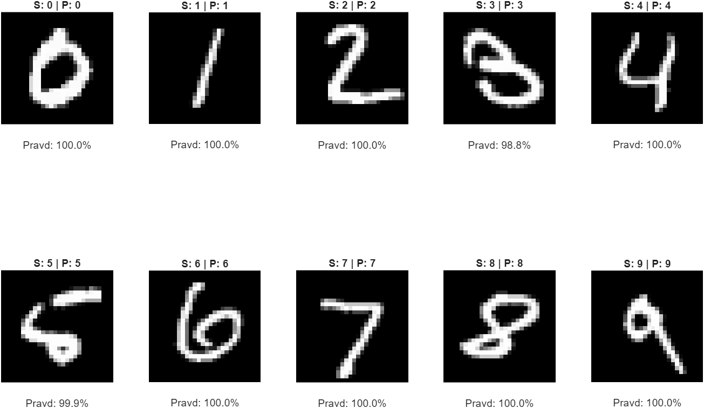
# dropout

| Nastavenie | Dropout |  Počet behov |  Priemer epochy začiatku pretrénovania| Priemer val loss | priemer test loss| priemer test acc | priemer train acc|
|---|---| ---|---|---|---|---|---|
| D1 | 0 | 5 | 8.54|  0.0295| 0.0292 | 99.24|  99.84|
| D2 |  0.5 | 5 | 17.76| 0.0242| 0.0259 | 99.26|  99.86|
| D3 |  0.7 | 5 | 11.86|  0.0305| 0.0249 | 99.3|  99.74|
---
## Grafy loss-epoch priebehu pre rôzne dropouty
### CNN1
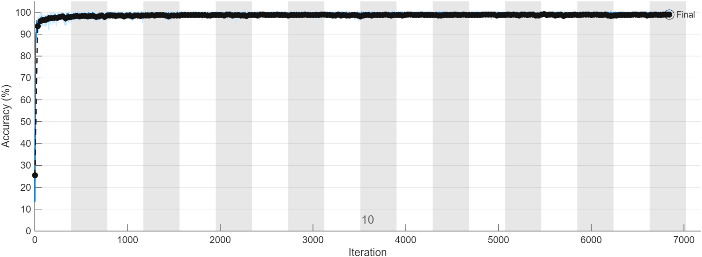
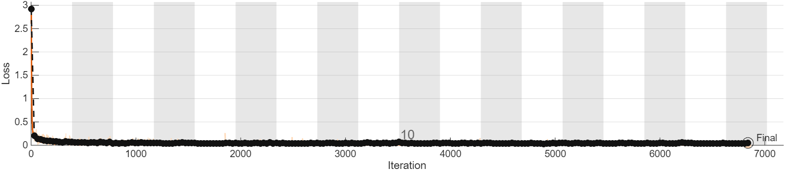

### CNN2
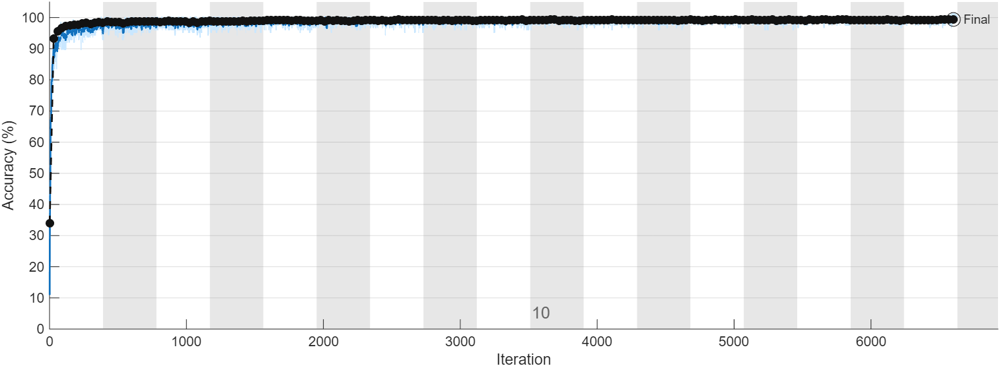
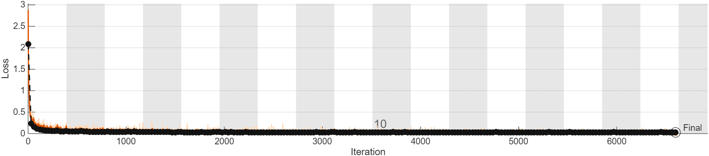
### CNN3
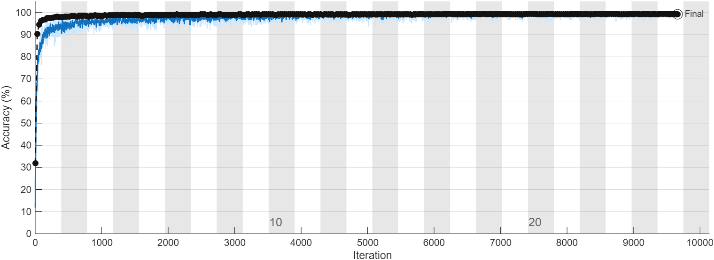
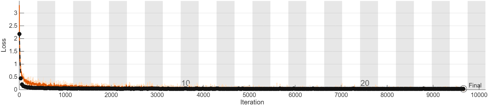
# Porovnanie rýchlosti trénovania

| Model | Epochy |CPU čas \[s\] | GPU čas \[s\] | Zlepšenie|
|---|---| ---|---|---|
| MLP1 | 100 | 181 | 61|   2.96X|
| CNN3 |  20 | 1132| 202| 5.6X|
| Priemer |  - | 656.5 | 131.5|  4.28X|
---
