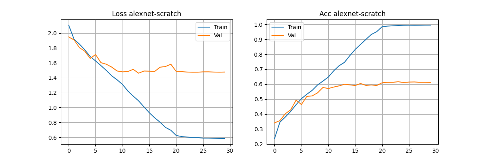
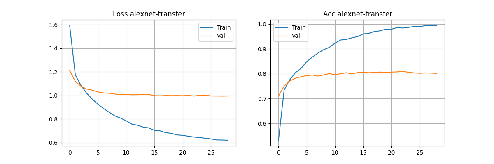
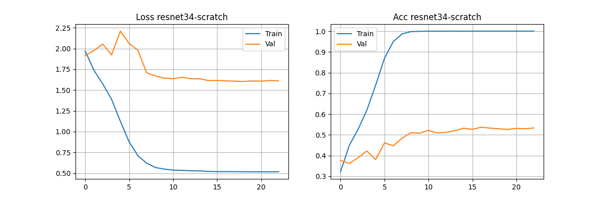
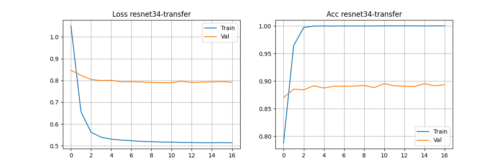
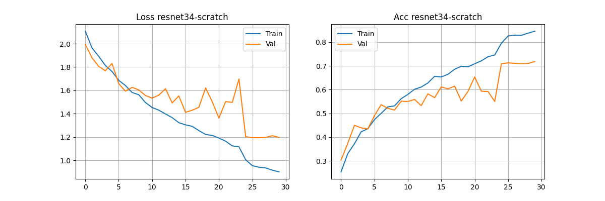
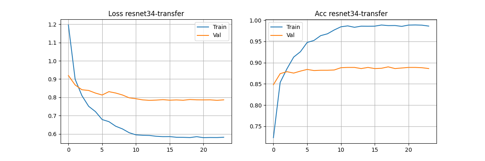
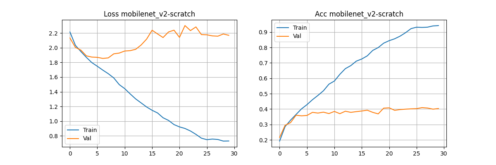
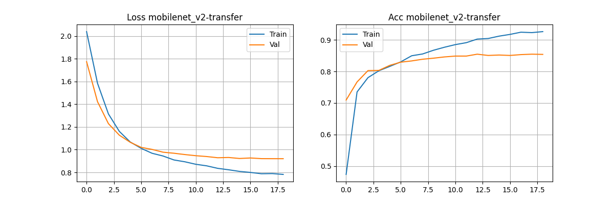

# UMINT – Zadanie 8: CNN od nuly vs. Transfer Learning

## Tabuľka 1: Zvolené modely a hlavné hyperparametre

| Model | Architektúra | Epochy (max) | LR | Batch | Early stopping |
|-------|-------------|-------------|----|-------|---------------|
| M1 | AlexNet | 30 | 0.0001 | 64 | patience=6 |
| M2 | ResNet34 | 30 | 0.0001 | 64 | patience=6 |
| M3 | MobileNet_v2 | 30 | 0.0001 | 64 | patience=6 |

---
### Tabuľka 1b: Parametre uprav vstupnych dat 
 
| Transformácia | Parameter | Popis |
|--------------|-----------|-------|
| Resize | 256 | Zmena veľkosti na 256×256 px |
| CenterCrop| 224/227(Alexnet) | Výrez 224×224/227x227(Alexnet) px |
 
## M1 – AlexNet

### Tabuľka 2: Výsledky 3 behov – from scratch

| Beh | Train loss | Train acc [%] | Val loss | Val acc [%] |  Test acc [%] | Skore ukončenie [epochy]|
|-----|-----------|--------------|---------|------------|------------|------------|
| 1 | 0.5838 | 99.53 | 1.4764 | 61.13 | 64.08 | 30 |
| 2 | 0.5612 | 99.77 | 1.4579 | 61.53 | 64.44 | 29 |
| 3 | 0.5816 | 99.48 | 1.4651 | 61.73 |  64.16 | 29|

### Tabuľka 3: Výsledky 3 behov – transfer learning (TL)

| Beh | Train loss | Train acc [%] | Val loss | Val acc [%] |  Test acc [%] | Skore ukončenie [epochy]|
|-----|-----------|--------------|---------|------------|------------|------------|
| 1 | 0.6194 | 99.43 | 0.9948 | 80.13 | 85.84 | 20 |
| 2 | 0.7178 | 95.42 | 1.0114 | 80.40 | 85.20 | 29 |
| 3 | 0.7685 | 93.10 | 1.0206 | 80.07 | 85.44 | 21 |

### Tabuľka 4: Súhrnné porovnanie scratch vs. TL – M1 (AlexNet)

| Režim | Priemer train loss | Priemer train acc [%] | Priemer val loss | Priemer val acc [%] | Priemer test loss | Priemer test acc [%] |
|-------|-------------------|----------------------|-----------------|--------------------|-----------------|--------------------|
| scratch | 0.5755 | 99.59 | 1.4665 | 61.47 | 1.3775 | 64.23 |
| TL | 0.7019 | 95.98 | 1.0089 | 80.20 | 0.9009 | 85.49 |

---

## M2 – ResNet34

### Tabuľka 5: Výsledky 3 behov – from scratch

| Beh | Train loss | Train acc [%] | Val loss | Val acc [%] |  Test acc [%] |Skore ukončenie [epochy]|
|-----|-----------|--------------|---------|------------|------------|------------|
| 1 | 0.5158 | 100.00 | 1.6104 | 53.33 | 55.04 | 23 |
| 2 | 0.5184 | 100.00 | 1.6094 | 52.07 |  53.72 | 17|
| 3 | 0.5159 | 100.00 | 1.6074 | 52.40 |  53.52 | 30|

### Tabuľka 6: Výsledky 3 behov – transfer learning (TL)

| Beh | Train loss | Train acc [%] | Val loss | Val acc [%] | Test acc [%] |Skore ukončenie [epochy]|
|-----|-----------|--------------|---------|------------|------------|------------|
| 1 | 0.5140 | 100.00 | 0.7920 | 89.33 | 92.60 | 17 |
| 2 | 0.5098 | 100.00 | 0.7956 | 89.07 |  93.16 | 29|
| 3 | 0.5158 | 100.00 | 0.7938 | 89.60 | 92.00 | 14 |

### Tabuľka 7: Súhrnné porovnanie scratch vs. TL – M2 (ResNet34)

| Režim | Priemer train loss | Priemer train acc [%] | Priemer val loss | Priemer val acc [%] | Priemer test loss | Priemer test acc [%] |
|-------|-------------------|----------------------|-----------------|--------------------|-----------------|--------------------|
| scratch | 0.5167 | 100.00 | 1.6091 | 52.60 | 1.5832 | 54.09 |
| TL | 0.5132 | 100.00 | 0.7938 | 89.33 | 0.7167 | 92.59 |

---

## M3 – MobileNet_v2

### Tabuľka 8: Výsledky 3 behov – from scratch

| Beh | Train loss | Train acc [%] | Val loss | Val acc [%] |  Test acc [%] |Skore ukončenie [epochy]|
|-----|-----------|--------------|---------|------------|---------|---------|
| 1 | 0.7294 | 94.20 | 2.1703 | 40.33 |  43.20 | 20|
| 2 | 1.2791 | 67.30 | 1.8923 | 40.73 |  43.88 | 19|
| 3 | 1.4224 | 59.78 | 1.8761 | 38.80 |  43.48 |18|
---
### Tabuľka 9: Výsledky 3 behov – transfer learning (TL)

| Beh | Train loss | Train acc [%] | Val loss | Val acc [%] |  Test acc [%] |Skore ukončenie [epochy]|
|-----|-----------|--------------|---------|------------|------------|---------|
| 1 | 0.7821 | 92.62 | 0.9205 | 85.40 |  89.56 |19|
| 2 | 0.6779 | 97.75 | 0.9024 | 86.07 | 89.64 |24|
| 3 | 0.7816 | 92.53 | 0.9243 | 85.60 | 89.24 |19|
---
### Tabuľka 10: Súhrnné porovnanie scratch vs. TL – M3 (MobileNet_v2)

| Režim | Priemer train loss | Priemer train acc [%] | Priemer val loss | Priemer val acc [%] | Priemer test loss | Priemer test acc [%] |
|-------|-------------------|----------------------|-----------------|--------------------|-----------------|--------------------|
| scratch | 1.1436 | 73.76 | 1.9796 | 39.96 | 1.8752 | 43.52 |
| TL | 0.7472 | 94.30 | 0.9157 | 85.69 | 0.8277 | 89.48 |

---

## Tabuľka 11: Porovnanie všetkých modelov – from scratch

| Model | Architektúra | Priemer test loss od nuly | Priemer test acc [%] od nuly | 
|-------|-------------|--------------------------|------------------------------|
| M1 | AlexNet | 1.3775 | 64.23 | 
| M2 | ResNet34 | 1.5832 | 54.09 | 
| M3 | MobileNet_v2 | 1.8752 | 43.52 |
---
## Tabuľka 12: Porovnanie všetkých modelov – transfer learning (TL)

| Model | Architektúra | Priemer test loss TL | Priemer test acc [%] TL | 
|-------|-------------|---------------------|------------------------|
| M1 | AlexNet | 0.9009 | 85.49 | 
| M2 | ResNet34 | 0.7167 | 92.59 | 
| M3 | MobileNet_v2 | 0.8277 | 89.48 |
---
## Augmentacia - ResNet34

### Tabuľka 13: Nastavenie augmentacie

| Transformácia | Parameter | Popis |
|--------------|-----------|-------|
| Resize | 256 | Zmena veľkosti na 256×256 px |
| RandomCrop| 224 | Náhodný výrez 224×224 px |
| RandomHorizontalFlip | – | Náhodné horizontálne zrkadlenie |
| ColorJitter | brightness=0.2, contrast=0.2, saturation=0.2, hue=0.1 | Náhodná zmena jasu, kontrastu, sýtosti a odtieňa |
| RandomRotation | 15° | Náhodná rotácia v rozsahu ±15° |
 ---
### Tabuľka 14: Výsledky 3 behov – from scratch (s augmentáciou)
 
| Beh | Train loss | Train acc [%] | Val loss | Val acc [%] | Test acc [%] |Skore ukončenie [epochy]|
|-----|-----------|--------------|---------|------------|------------|------------|
| 1 | 0.9015 | 84.60 | 1.1971 | 71.80 | 77.12 |30|
| 2 | 1.2290 | 69.43 | 1.3337 | 63.60 | 68.48 |21|
| 3 | 1.1286 | 73.88 | 1.2917 | 66.73 |  71.48 |24|
 ---
### Tabuľka 15: Výsledky 3 behov – transfer learning (TL) (s augmentáciou)
 
| Beh | Train loss | Train acc [%] | Val loss | Val acc [%] |  Test acc [%] |Skore ukončenie [epochy]|
|-----|-----------|--------------|---------|------------|------------|------------|
| 1 | 0.5821 | 98.60 | 0.7864 | 88.60 | 92.92 |24|
| 2 | 0.6266 | 97.25 | 0.7871 | 89.53 |  93.40 |15|
| 3 | 0.5594 | 99.33 | 0.7796 | 89.87 |  93.12 |30|
 ---
### Tabuľka 16: Súhrnné porovnanie scratch vs. TL – M2 (ResNet34) (s augmentáciou)
 
| Režim | Priemer train loss | Priemer train acc [%] | Priemer val loss | Priemer val acc [%] | Priemer test acc [%] |
|-------|-------------------|----------------------|-----------------|--------------------|--------------------|
| scratch | 1.0864 | 75.97 | 1.2742 | 67.38 | 72.36 |
| TL | 0.5894 | 98.39 | 0.7844 | 89.33 | 93.15 |
 ---
### Tabuľka 17: Porovnanie TL bez augmentácie vs. s augmentáciou – M2 (ResNet34)
 
| Varianta | Priemer val loss | Priemer val acc [%] | Priemer test acc [%] | Priemerne skore ukončenie [epochy]|
|----------|-----------------|--------------------|--------------------|--------------------|
| TL bez augmentácie | 0.7938 | 89.33 | 92.59 | 20 |
| TL s augmentáciou | 0.7844 | 89.33 | 93.15 |  23|
---
## Grafy priebehu učenia
 
### AlexNet
 

 
### ResNet34 - bez augmentacie
 

### ResNet34 - s augmentaciou

 
### MobileNet_v2
 

 
---

## Predikcie
### AlexNet

### ResNet34 bez augmentacie

### ResNet34 s augmentaciou

###MobileNet_v2

