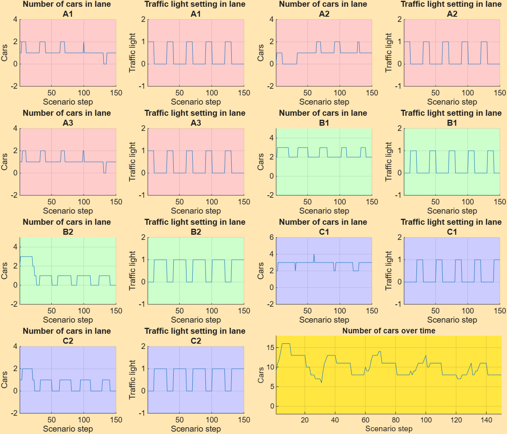
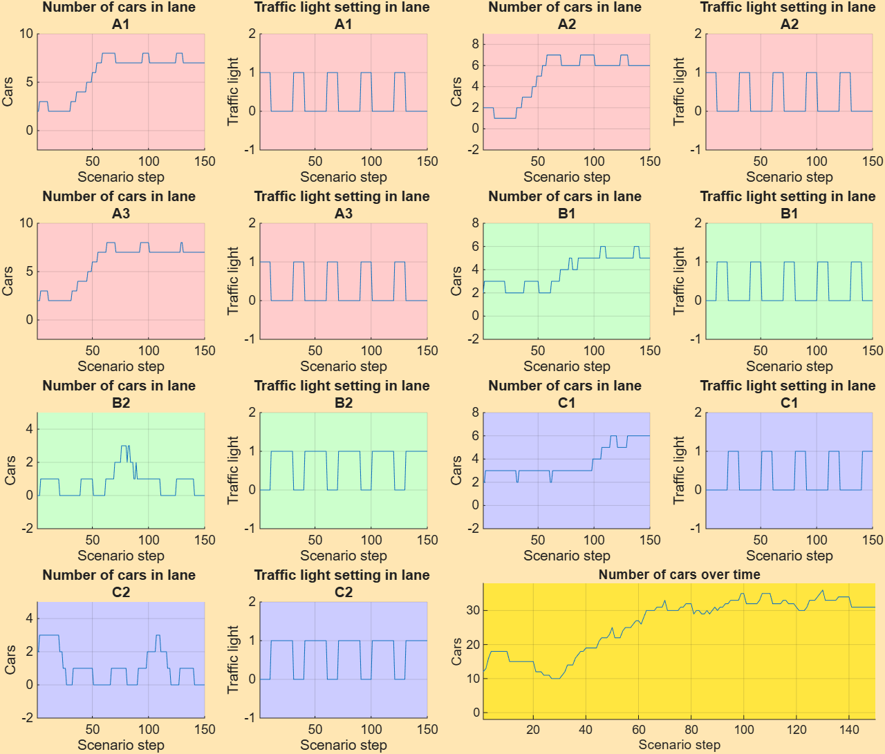
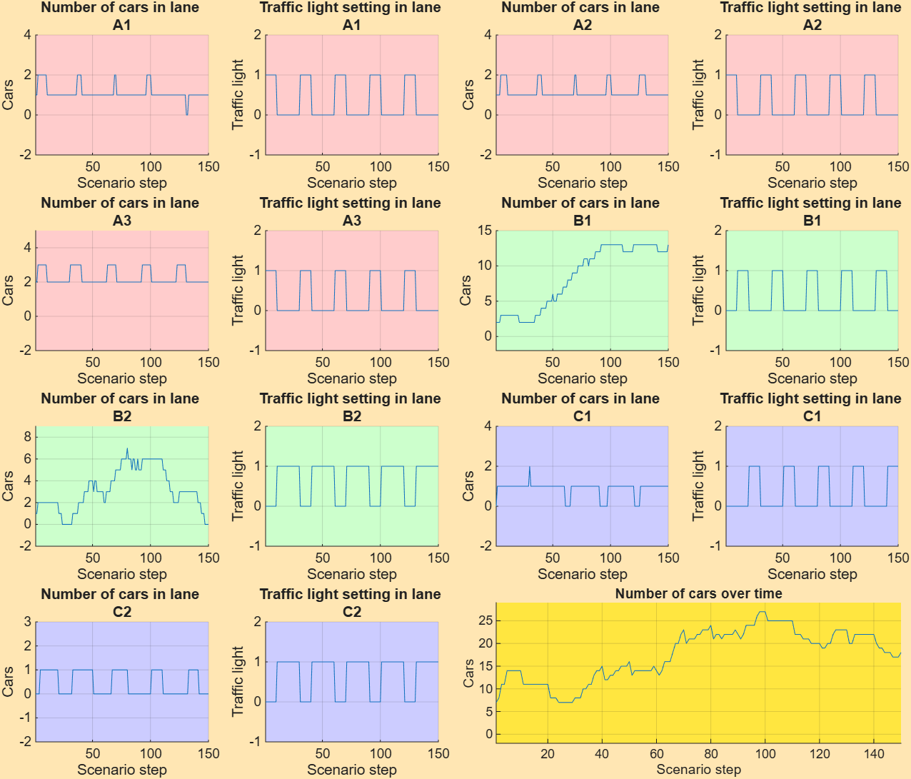
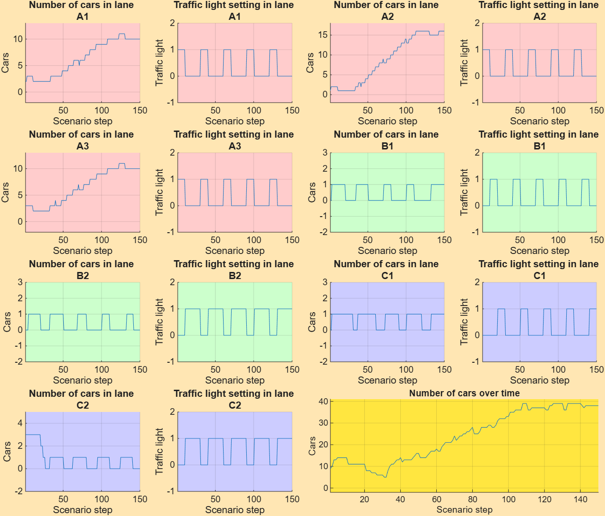
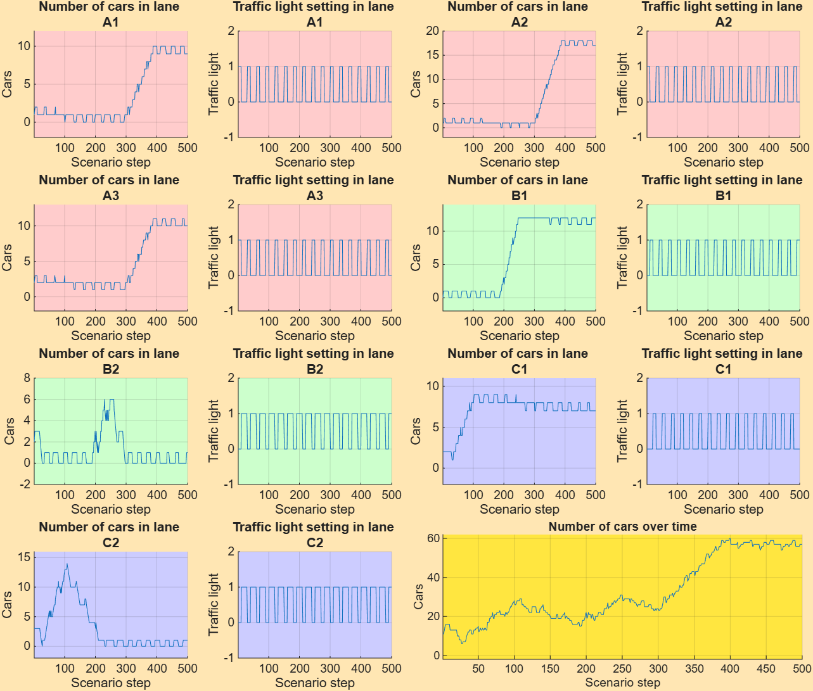
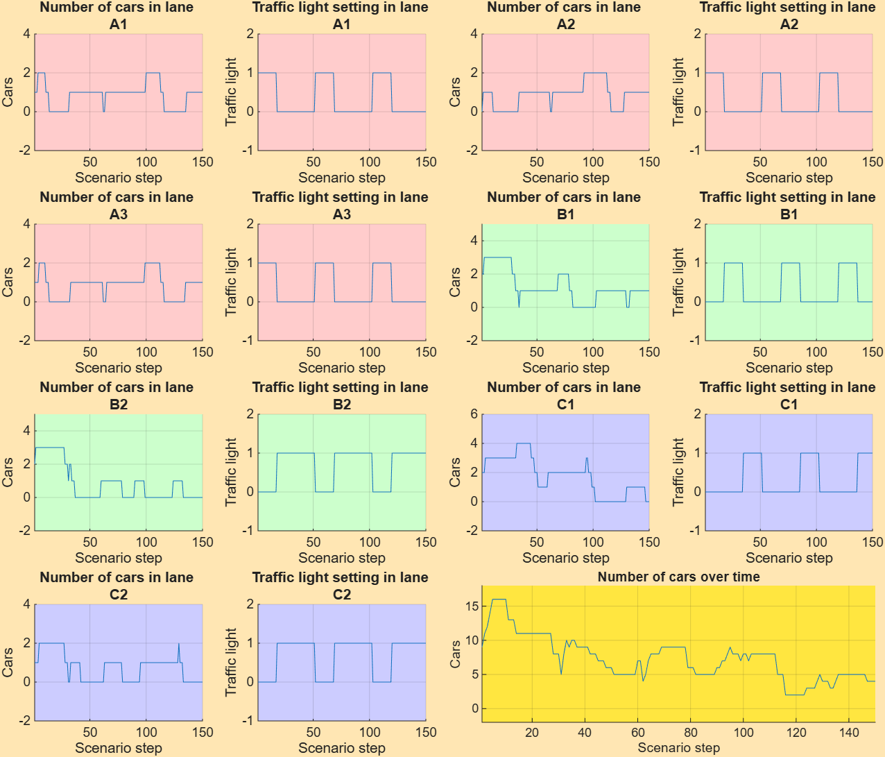
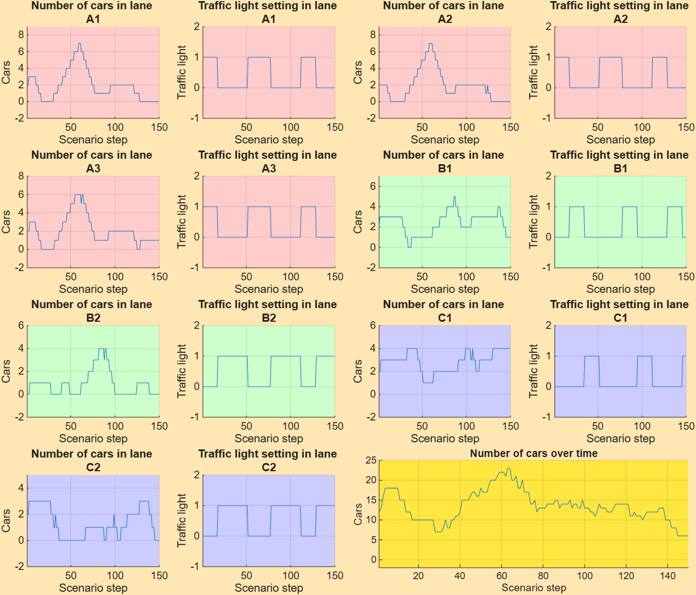
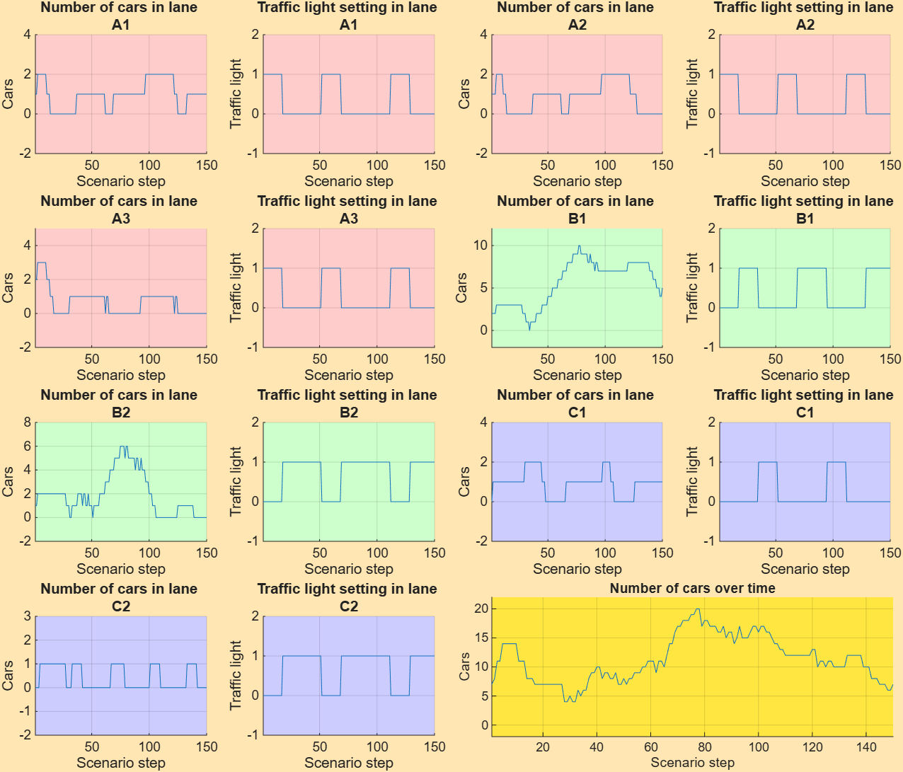
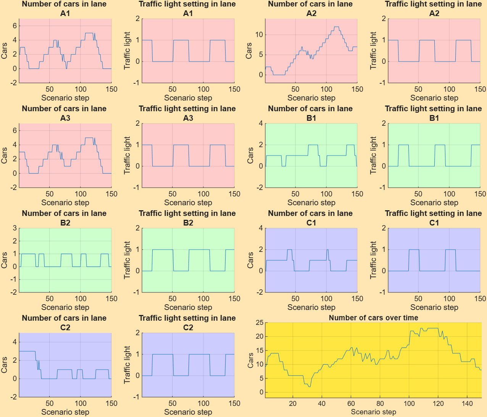
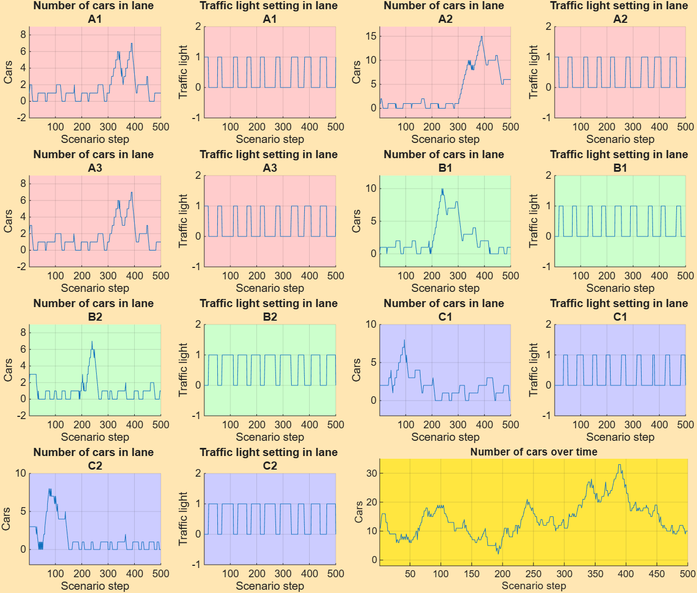

# Zadanie 9: Fuzzy logika – Riadenie križovatky

##  Pevné riadenie s intervalom [10, 10, 10]

#### Režim 1

#### Režim 2

#### Režim 3

#### Režim 4

#### Režim 5

#### Režim 6

### tabuľka pre pevné riadenie

| Režim | Max áut | Final áut | A1 | A2 | A3 | B1 | B2 | C1 | C2 |
|:-----:|:-------:|:---------:|:--:|:--:|:--:|:--:|:--:|:--:|:--:|
| 1 | 16 | 8  | 2  | 2  | 2  | 3  | 3  | 4  | 2  |
| 2 | 36 | 31 | 2  | 2  | 3  | 6  | 3  | 6  | 3  |
| 3 | 25 | 17 | 2  | 1  | 3  | 2  | 2  | 13 | 6  |
| 4 | 27 | 18 | 2  | 2  | 3  | 13 | 7  | 2  | 1  |
| 5 | 39 | 38 | 11 | 16 | 11 | 2  | 1  | 1  | 3  |
| 6 | **60** | **57** | 10 | 18 | 11 | 12 | 6  | 9  | 14 |
---
## Fuzzy riadenie

###  Návrh fuzzy systému

**Vstupy:**
- `cars_green` – celkový počet áut na zelenej (rozsah `[0, 30]`)
- `cars_red` – celkový počet áut na červenej (rozsah `[0, 60]`)

**Výstup:**
- `duration` – doba trvania momentálnej konfigurácie semaforov (rozsah `[5, 30]` krokov)

###  Funkcie 

#### Vstup `cars_green` (počet áut na zelenej)

|hodnota | Typ | Parametre |
|---|---|---|
| `low` (málo) | trimf | [0, 0, 5] |
| `medium` (stredne) | trimf | [3, 7, 12] |
| `high` (veľa) | trimf | [8, 14, 30] |

#### Vstup `cars_red` (počet áut na červenej)

| hodnota | Typ | Parametre |
|---|---|---|
| `low` | trimf | [0, 3, 10] |
| `medium` | trimf | [5, 15, 30] |
| `high` | trimf | [15, 35, 60] |

#### Výstup `duration` (doba trvania zelenej)

|  hodnota | Typ | Parametre |
|---|---|---|
| `short` (krátko) | trimf | [5, 5, 12] |
| `medium` (normálne) | trimf | [10, 18, 25] |
| `long` (dlho) | trapmf | [20, 28, 30, 30] |

### Báza pravidiel

Fuzzy systém obsahuje **5 pravidiel**:

| # | Ak `cars_green` je... | a `cars_red` je... | potom `duration` je... |
|:-:|---|---|---|
| 1 | high | low | long |
| 2 | any | high | short |
| 3 | medium | medium | medium |
| 4 | high | medium | long |
| 5 | low | low | medium |

###  Výsledky jednotlivých behov

#### Režim 1 

#### Režim 2 

#### Režim 3 

#### Režim 4 

#### Režim 5

#### Režim 6

### tabuľka pre fuzzy riadenie

| Režim | Max áut | Final áut | A1 | A2 | A3 | B1 | B2 | C1 | C2 |
|:-----:|:-------:|:---------:|:--:|:--:|:--:|:--:|:--:|:--:|:--:|
| 1 | 16 | 4  | 2 | 2  | 2 | 3  | 3 | 4  | 2 |
| 2 | 23 | 6  | 7 | 7  | 6 | 5  | 4 | 4  | 5 |
| 3 | 21 | 10 | 2 | 2  | 3 | 2  | 2 | 13 | 6 |
| 4 | 20 | 7  | 2 | 2  | 3 | 10 | 6 | 2  | 1 |
| 5 | 23 | 8  | 5 | 12 | 5 | 2  | 1 | 2  | 3 |
| 6 | **33** | **10** | 7 | 15 | 7 | 10 | 7 | 8  | 8 |

---

##  Porovnanie pevného a fuzzy riadenia

###  Súhrnná porovnávacia tabuľka

| Režim | Pevné max | Pevné final | Fuzzy max | Fuzzy final | Δ max | Δ final |
|:-:|:-:|:-:|:-:|:-:|:-:|:-:|
| 1 | 16 | 8 | 16 | 4 | 0 | **−4** |
| 2 | 36 | 31 | 23 | 6 | **−13** | **−25** |
| 3 | 25 | 17 | 21 | 10 | **−4** | **−7** |
| 4 | 27 | 18 | 20 | 7 | **−7** | **−11** |
| 5 | 39 | 38 | 23 | 8 | **−16** | **−30** |
| 6 | 60 | 57 | 33 | 10 | **−27** | **−47** |

### Porovnanie maximálnych hodnôt v pruhoch (režim 6)

| Pruh | Pevné | Fuzzy | Zlepšenie |
|:-:|:-:|:-:|:-:|
| A1 | 10 | **7** | −3 |
| A2 | 18 | **15** | −3 |
| A3 | 11 | **7** | −4 |
| B1 | 12 | **10** | −2 |
| B2 | 6 | 7 | +1 |
| C1 | 9 | 8 | −1 |
| C2 | 14 | **8** | **−6** |

###  Overenie limitov zo zadania pre režim 6

| Kritérium | Limit | Skutočnosť | Stav |
|---|---|:-:|:-:|
| A1 ≤ 10 áut | ≤ 10 | 7 | ✅ |
| A2 ≤ 15 áut | ≤ 15 | 15 | ✅ |
| A3 ≤ 10 áut | ≤ 10 | 7 | ✅ |
| B1 ≤ 10 áut | ≤ 10 | 10 | ✅ |
| B2 ≤ 10 áut | ≤ 10 | 7 | ✅ |
| C1 ≤ 10 áut | ≤ 10 | 8 | ✅ |
| C2 ≤ 10 áut | ≤ 10 | 8 | ✅ |
| Maximálny počet áut počas scenára | ≤ 40 | **33** | ✅ |
| Počet áut na konci scenára | < 20 | **10** | ✅ |

---
